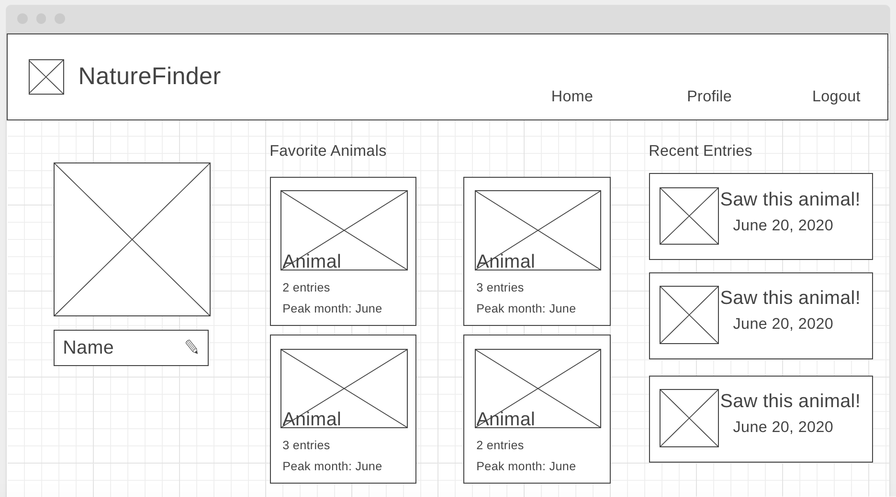

# Nature Finder

Web application using API calls

## 1. Project Planning

#### Finding APIs

The ideas for the project began with finding APIs to use. This project namely uses two:

* **GBIF (Global Biodiversity Information Facility)** -  API and database for wildlife occurences. 
[Website](https://www.gbif.org/developer/summary)

* **Unplugg** - API for time series forecasting. [Website](https://unplu.gg/test_api.html)

The idea was to create an app that shows animals in a particular area and predict the number of sightings over the next time period. Users can use this information to determine when is a best time to see a particular animal. 

#### API Calls

To ensure that the pertinent information could be pulled from the api, several sample calls were made. It was found that the GBIF could search for occurences based on a logitude and latitude range. Since the intention was for a user to input a zipcode or location name in the search function, another API would need to be used to change that location into a latitude and longitude range. [OpenDataSoft](https://public.opendatasoft.com/explore/dataset/us-zip-code-latitude-and-longitude/api/?q=seattle) has a public API that can translate US zipcodes and city names into a latitude and longitude. A range would be tacked onto this before calling the GBIF API. 

It was also noted that the GBIF API does not provide common animal names, only the species. The [Wikipedia API](https://www.mediawiki.org/wiki/MediaWiki) would need to be called for this information. 

**MVP** 

As a basic MVP, it was decided from the information able to be pulled from the API that a basic user interaction would have these steps:

1. *Search by zipcode or location.* This would then be translated into a latitude and longitude range.
2. *Show animals in that location.* The GBIF API would be called using the range from the previous step, and resulting occurences would need to be mapped into an array of unique animals based on species.
3. *Click on an animal to view its information.* For the animal clicked upon by the user, a species call would be made to the GBIF API using the unique species key for that animal. Next, another occurence call would be made to list recent occurences of that animal. 
4. *Allow the user to save the animal for later.* If the user is logged in, there would be an option on the page for the user to save the animal as a favorite. Its information would then be stored in a database and retrieved when they view their profile page. 
5. *Allow the user to make a journal entry about the animal.* For animals saved to the user's profile, there would be an option for them to say that they saw the animal. Then, they would be able to fill out a form to write a journal entry based on the sighting. The entry would then appear on their profile page. 

#### Database

TODO: ADD RELATIONAL TABLES PIC

Three tables were planned for the database: users, favorite animals, and journal entries. Users to animals would be a many to many ratio, but journals would be one to many with both users and animals. The database was created by creating models using Sequelize, and then migrating them to a PSQL database. Next, the database was pre-populated by using sequelize commands in a javascript test file. 

#### Routing

21 different routes were imagined for the site: 13 GET routes, 4 POST routes, 2 PUT routes, and 2 DELETE routes. 

1. *Auth and Profle* The first group of routes were the authorization and profile routes. Routes were defined to make a new profile, log in, edit or view the profile, and log out. This was accomplished by manipulating the user in the database via sequelize. 

#### User Flow and Wireframes

*Initial User Flow Diagram*

A user flow was mocked up to determine how a new or past user would navigate the sight. Then, several wireframes were developed to determine the layout of some of the more complex webpages, such as the home page. Next, UX students were consulted to critique the user flow and wireframes.

*Wireframe for Homepage*

*Wireframe for a user profile*

*Wireframe to show an animal*

*Wireframe to show a user's journal entry*

